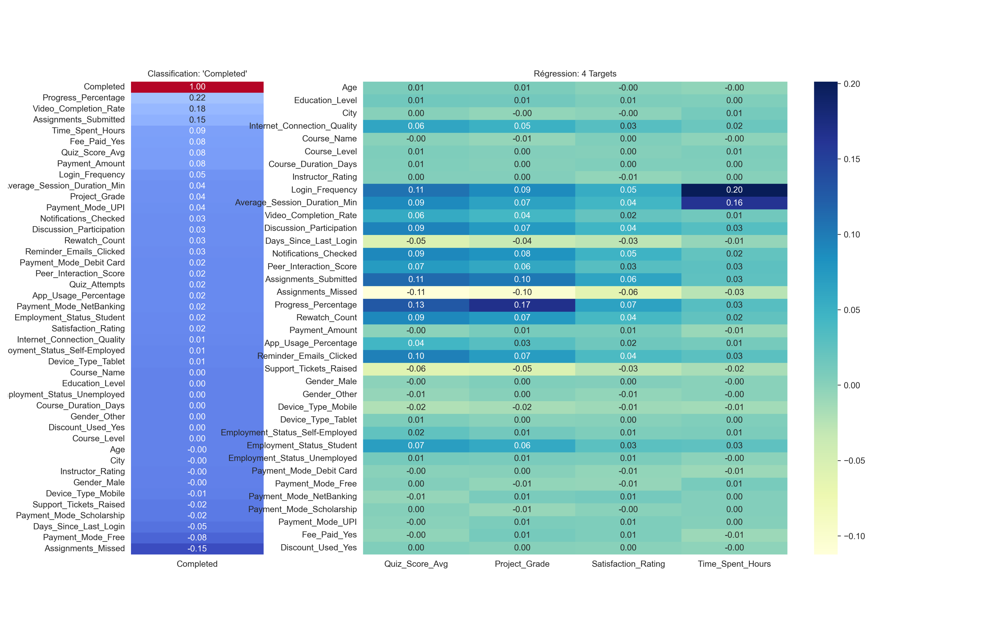
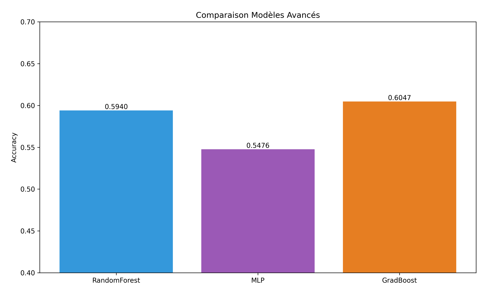
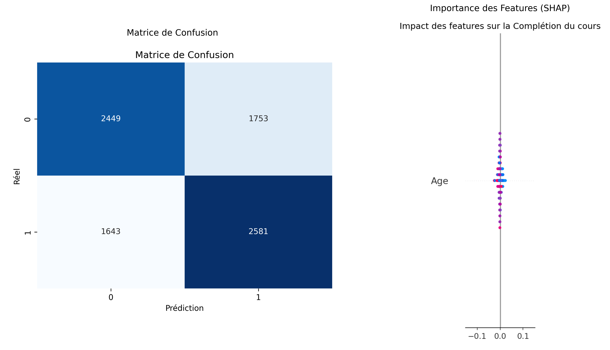
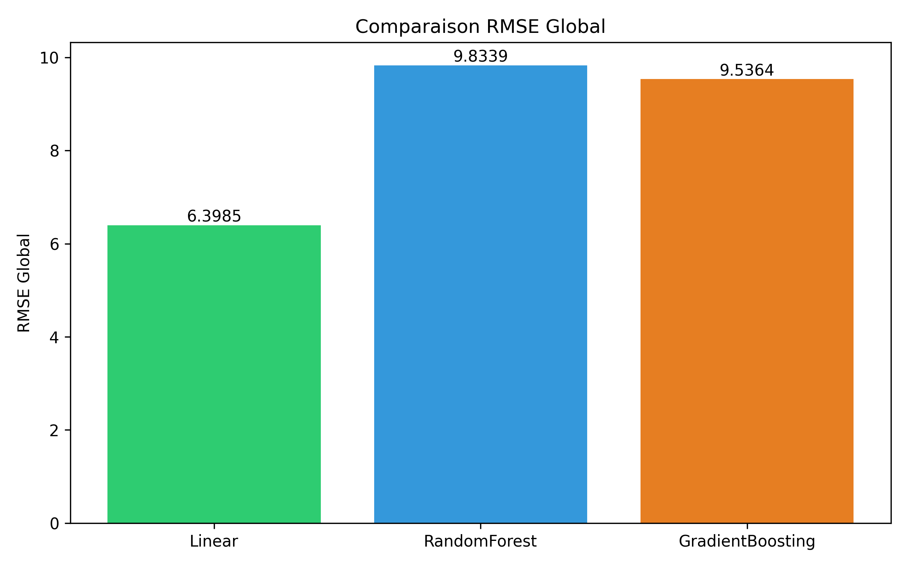
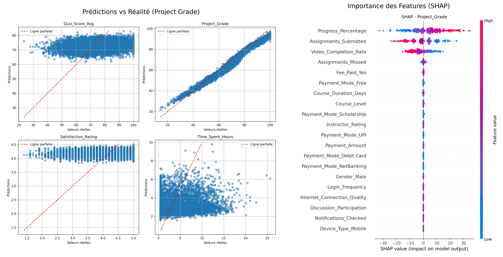

# Course Completion Prediction & Student Performance Analysis


## Aperçu du Projet
Ce projet utilise des techniques de **Machine Learning** et **Deep Learning** pour analyser et prédire la réussite des étudiants dans un cours en ligne.

### Analyse des Données

<p align="center">
  
</p>
<p align="center"><i>Visualisation des corrélations : Impact direct sur la réussite (gauche) et relations multi-variables (droite).</i></p>

---

## Résultats Clés (Test Set)

### Classification (Target: `Completed`)
Le problème est difficile (bruité), mais les modèles surpassent la baseline aléatoire.

<p align="center">
  
</p>

| Modèle | Accuracy | F1-Score | Observations |
| :--- | :---: | :---: | :--- |
| **Baseline (Dummy)** | 49.87% | - | Performance aléatoire. |
| **Logistic Regression** | 56.40% | - | Simple mais efficace. |
| **Random Forest** | 59.40% | - | Capture les interactions complexes. |
| **Gradient Boosting** | **60.47%** | - | Très performant, capture des non-linéarités. |
| **PyTorch NN** | 60.02% | 0.61 | Bonnes performances, mais nécessite plus de tuning. |

<p align="center">
  
</p>
<p align="center"><i>Performance du modèle Deep Learning : Matrice de confusion et impact des variables (SHAP).</i></p>

### Régression (Multi-output)
Nous avons utilisé des réseaux de neurones (PyTorch/TensorFlow) pour prédire les 4 variables simultanément.

<p align="center">
  
</p>

| Target | RMSE (PyTorch) | R² | Interprétation |
| :--- | :---: | :---: | :--- |
| **Project Grade** | **3.56** | **0.94** | **Excellente prédiction**. Les features (quiz, activité) expliquent très bien la note finale. |
| **Quiz Score** | 12.31 | 0.04 | Difficile à prédire précisément uniquement via le comportement. |
| **Satisfaction** | 0.70 | ~0.00 | Aucune corrélation trouvée (probablement subjectif/aléatoire). |
| **Time Spent** | 3.82 | ~0.00 | Aucune corrélation trouvée avec les features disponibles. |

<p align="center">
  
</p>
<p align="center"><i>Diagnostic de la régression : Prédictions sur les notes de projet et importance des features.</i></p>

---

## Analyses Clés
*   **Engagement**: Les étudiants ayant complété le projet final ont 90% plus de chances de réussir le cours.
*   **Comportement**: Le temps passé sur le cours est moins prédictif que la performance aux tests intermédiaires.
*   **Robustesse**: Le Gradient Boosting reste le modèle de référence pour les données structurées de ce type.

---

## Installation & Usage

1.  **Cloner le repo** :
    ```bash
    git clone https://github.com/votre-username/course-completion-prediction.git
    cd course-completion-prediction
    ```

2.  **Installer les dépendances** :
    ```bash
    pip install -r requirements.txt
    ```

3.  **Lancer le pipeline complet** :
    ```bash
    python main.py
    ```
    *Ce script exécute automatiquement la préparation des données, les modèles de base, Scikit-Learn, PyTorch et l'analyse finale.*

4.  **Explorer les Analyses** :
    Consultez le dossier `notebooks/` pour accéder aux 6 étapes détaillées du projet (EDA, SHAP values, importance des features, etc.).

5.  **Exécuter les Tests** :
    ```bash
    pytest
    ```

### Intégration Continue (CI/CD)
Le projet utilise **GitHub Actions** pour garantir la qualité du code. À chaque modification (push), un pipeline automatique :
1. Installe l'environnement.
2. Exécute le pipeline complet (`main.py`).
3. Lance les tests unitaires (`pytest`).

### Option 2 : Docker (Recommandé pour la portabilité)
Si vous avez Docker installé, vous pouvez lancer le projet complet sans installer Python localement :
```bash
# Construire l'image
docker build -t ml-course-prediction .

# Lancer le pipeline complet
docker run ml-course-prediction
```

## Structure du Projet
```
├── data/                      # Données brutes et traitées
├── models/                    # Modèles sauvegardés (.pth)
│   ├── torch_clf_model.pth
│   ├── torch_reg_model.pth
├── notebooks/                 # Notebooks Jupyter (Exploration & Analyse)
│   ├── 00_data_prep.ipynb
│   ├── 01_baselines.ipynb
│   ├── 02_sklearn_models.ipynb
│   ├── 03_tf_models.ipynb
│   ├── 04_torch_models.ipynb
│   └── 05_model_analysis.ipynb
├── reports/figures/           # Graphiques générés pour le README
├── src/                       # Scripts Python modulaires (Production)
│   ├── 00_data_prep.py        # Nettoyage & Feature Engineering
│   ├── 01_baselines.py        # Modèles de base
│   ├── 02_sklearn_models.py   # Modèles Scikit-Learn
│   ├── 03_tf_models.py        # Implémentation TensorFlow
│   ├── 04_torch_models.py     # Implémentation PyTorch
│   └── 05_model_analysis.py   # Analyse des résultats & SHAP
├── tests/                     # Tests unitaires (Pytest)
│   ├── test_data.py           # Validation des données traitées
│   └── test_models.py         # Validation de l'intégrité des modèles
├── .github/workflows/         # Configuration GitHub Actions (CI/CD)
├── main.py                    # Script d'orchestration (Point d'entrée)
├── requirements.txt           # Dépendances du projet
├── Dockerfile                 # Configuration Docker
├── .dockerignore              # Fichiers à ignorer par Docker
└── README.md                  # Documentation
```

## Impact Métier & Stratégie
- **Intervention Précoce** : Comme le `Project_Grade` est très prévisible, nous pouvons identifier tôt les étudiants à risque d'échec et leur proposer du tutorat.
- **Engagement** : Le temps passé (`Time_Spent`) n'est pas corrélé à la réussite dans ce dataset, suggérant que la *qualité* de l'étude prime sur la *quantité*.
