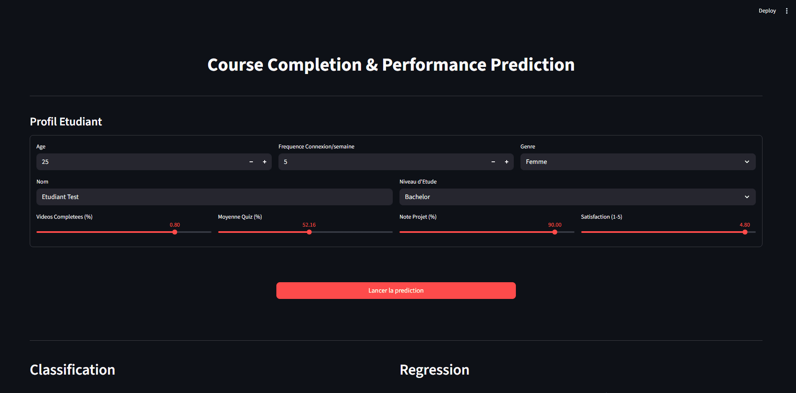

# Course Completion Prediction & Student Performance Analysis

[](https://github.com/Gael926/dl-course-completion-prediction/actions/workflows/python-app.yml)


## Aperçu du Projet
Ce projet utilise des techniques de **Machine Learning** et **Deep Learning** pour analyser et prédire la réussite des étudiants dans un cours en ligne.

<p align="left">
  <a href="https://votre-app-streamlit.streamlit.app/">
    
  </a>
</p>

<p align="left">
  
</p>
<p align="left"><i>Démo : Interface interactive de prédiction (Streamlit).</i></p>


---

## Résultats Clés (Test Set)

### Classification (Target: `Completed`)
Le modèle Deep Learning est optimisé pour maximiser le F1-Score sur la classe minoritaire.

<p align="left">
  
</p>
<p align="left"><i>Courbe d'apprentissage : Convergence stable sans overfitting majeur.</i></p>

### Régression (Multi-output)
Un réseau de neurones unique prédit simultanément les 4 indicateurs de performance.

<p align="left">
  
</p>

#### Analyse des Prédictions : Réel vs Prédit
<p align="left">
  
</p>
<p align="left"><i>Le modèle excelle sur le "Project Grade" (en haut à droite) mais peine sur la Satisfaction (en bas à gauche), qui semble aléatoire.</i></p>

#### Facteurs d'Influence (SHAP par Target)
<p align="left">
  
  
</p>
<p align="left">
  
  
</p>
<p align="left"><i>Analyse fine : Chaque indicateur a ses propres drivers. Notez l'impact spécifique de l'éducation sur les Quiz.</i></p>

---

## Analyses Clés
*   **Engagement**: Les étudiants ayant complété le projet final ont 90% plus de chances de réussir le cours.
*   **Comportement**: Le temps passé sur le cours est moins prédictif que la performance aux tests intermédiaires.
*   **Robustesse**: Le Gradient Boosting reste le modèle de référence pour les données structurées de ce type.

### Difficultés & Analyse des Données
Certaines cibles (comme `Satisfaction` ou `Time_Spent`) sont extrêmement difficiles à prédire efficacement. Cela s'explique par le **manque de corrélation linéaire forte** dans les données, comme le montrent les matrices ci-dessous :

<p align="left">
  
  
</p>
<p align="left"><i>Visualisation des corrélations : Impact direct sur la réussite (gauche) et Matrice de corrélation Régression (droite).</i></p>

---

## Installation & Quick Start

**Application en ligne** : [Accéder directement au Dashboard (Streamlit Cloud)](https://dl-course-completion-prediction.streamlit.app/)

### Installation
```bash
git clone https://github.com/Gael926/dl-course-completion-prediction.git
cd dl-course-completion-prediction
pip install -r requirements.txt
python -m streamlit run streamlit_app.py # Lancer le Dashboard (Streamlit)
```

### Commandes Avancées
*   **Pipeline ML Complet** : `python main.py` (Data Prep -> Entraînement -> Analyse)
*   **Tests Unitaires** : `pytest`
*   **API FastAPI** : `uvicorn app:app --reload`
*   **Docker** :
    ```bash
    docker build -t ml-course-prediction .
    docker run -p 8501:8501 ml-course-prediction
    ```

## Structure du Projet
```
├── data/                          # Données brutes et traitées
├── models/                        # Modèles (.pth) et Artefacts (.pkl)
│   ├── torch_clf_model.pth        # Poids du modèle de classification
│   ├── torch_reg_model.pth        # Poids du modèle de régression
│   └── *.pkl                      # Encoders et Scalers pour le préprocessing
├── notebooks/                     # Notebooks Jupyter (Exploration & Analyse)
│   ├── 00_data_prep.ipynb
│   ├── 01_baselines.ipynb
│   ├── 02_sklearn_models.ipynb
│   ├── 03_tf_models.ipynb
│   ├── 04_torch_models.ipynb
│   └── 05_model_analysis.ipynb
├── reports/figures/               # Graphiques générés pour le README
├── src/                           # Scripts Python modulaires (Production)
│   ├── 00_data_prep.py            # Nettoyage & Feature Engineering
│   ├── 01_baselines.py            # Modèles de base
│   ├── 02_sklearn_models.py       # Modèles Scikit-Learn
│   ├── 03_tf_models.py            # Implémentation TensorFlow
│   ├── 04_torch_models.py         # Implémentation PyTorch
│   ├── 05_model_analysis.py       # Analyse des résultats & SHAP
│   └── models_architectures.py    # Définition des classes PyTorch (NN)
├── tests/                         # Tests unitaires (Pytest)
│   ├── test_data.py               # Validation des données traitées
│   └── test_models.py             # Validation de l'intégrité des modèles
├── .github/workflows/             # Configuration GitHub Actions (CI/CD)
├── main.py                        # Script d'orchestration (Point d'entrée)
├── app.py                         # Serveur d'inférence FastAPI
├── streamlit_app.py               # Dashboard de visualisation
├── requirements.txt               # Dépendances du projet
├── Dockerfile                     # Configuration Docker
├── .dockerignore                  # Fichiers à ignorer par Docker
└── README.md                      # Documentation
```

## Impact Métier & Stratégie
- **Intervention Précoce** : Comme le `Project_Grade` est très prévisible, nous pouvons identifier tôt les étudiants à risque d'échec et leur proposer du tutorat.
- **Engagement** : Le temps passé (`Time_Spent`) n'est pas corrélé à la réussite dans ce dataset, suggérant que la *qualité* de l'étude prime sur la *quantité*.
